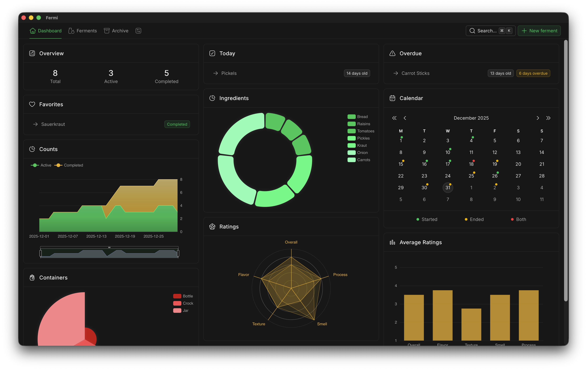
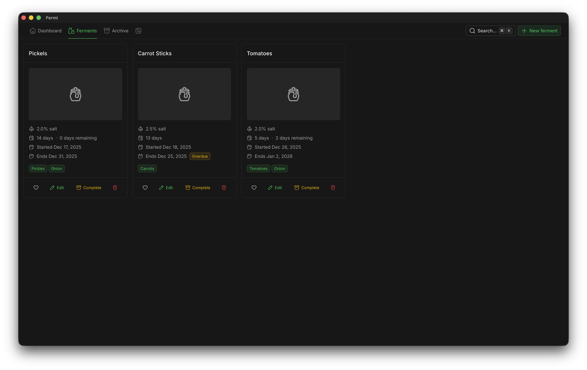

# Fermi

> A free fermentation tracking app built with Nuxt and Tauri, based on [Nuxtor](https://github.com/NicolaSpadari/nuxtor).

## Features

- Track ferments with ingredients, containers, images, start and end dates, salt ratios, as well as notes and ratings.
- Visualize your fermentation journey with charts and statistics.
- Get reminders for due and overdue ferments.
- Browse data of completed and failed ferments with sorting and filtering.
- Data is stored in JSON files, enabling automated backups.

## Installation

1. Go to the [latest release](https://github.com/DerYeger/fermi/releases/latest) and download the installer for your operating system.
2. Run the installer and follow the instructions. On MacOS, you have to run "xattr -c /Applications/Fermi.app" in the terminal after installing the app.
3. Launch Fermi and start tracking your ferments!
4. (Optional) Go to the settings and change the data directory if you want to store your data in a different location.

## Stack

- Nuxt
- Tauri
- NuxtUI
- TanStack DB
- TanStack Table
- ECharts

## License

Fermi is licensed under the [MIT License](./LICENSE).
